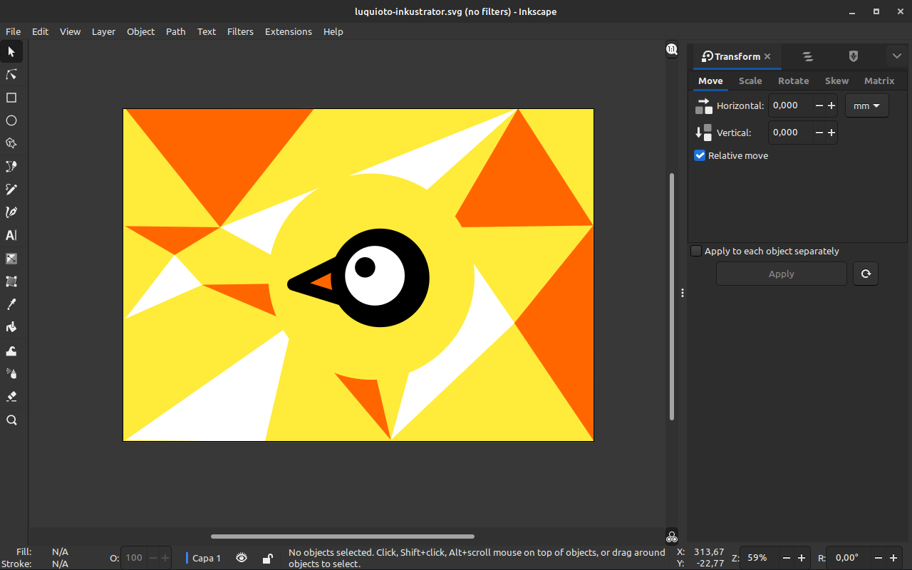

# 🎨 Inkustrator

A patch for optimizing Inkscape 1.2.1+ for Adobe Illustrator users, including features like:

* UI organization to mimic Adobe Illustrator;
* Fixed Adobe Illustator shortcuts similar to the ones in Illustrator for Windows, following [Adobe’s Documentation](https://helpx.adobe.com/es/illustrator/using/default-keyboard-shortcuts.html);
* [Pantano color palettes](https://www.jesusda.com/projects/colorpalettes/index.html)

(Same as [Diolinux's PhotoGIMP](https://github.com/Diolinux/PhotoGIMP) but instead of Photoshop to GIMP it's Illustrator to Inkscape) 

  
**📷 Screenshot**

## ⚙ Install

Download [last zip Inkustrator release](https://github.com/lucasgabmoreno/inkustrator/releases/latest) and past content into configuration folder.

## ⚙ Configuration folders

| OS | Configuration folder |
| :--- | :--- |
| Windows | *%APPDATA%\Inkscape* |
| MacOS | *~Library/Application Support/Inkscape/* |
| Linux PPA and AppImage | *$HOME/.config/inkscape* |
| Linux Flatpack | *$HOME/.var/app/org.inkscape.Inkscape/config/inkscape* |
| Ubuntu Snap | *$HOME/snap/inkscape/5874/.config/inkscape/* |

## ⚙ All in one installer
For Chrome OS, Debian, Ubuntu or derivatives use [this installer](https://github.com/lucasgabmoreno/bashinstallers/edit/main/inkscape/README.md)

## Thanks
* [Inkscape](https://inkscape.org/)
* [Inkscape wiki](https://wiki.inkscape.org/wiki/Inkscape_for_Adobe_Illustrator_users)
* [Diolinux](https://github.com/Diolinux/PhotoGIMP)
* [Jesús David Navarro](https://www.jesusda.com/projects/colorpalettes/index.html)
* [Sanjula Lakpahana](https://youtu.be/fzEjBldtba4)
* [Adobe](https://helpx.adobe.com/es/illustrator/using/default-keyboard-shortcuts.html)
